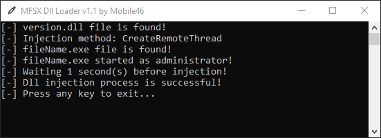

# MFSX.DllLoader
A Auto DLL Injector written in C# that implements the Simple-Injection library.



# Usage
Download and run once latest [DllLoader.exe](https://github.com/mobile46/MFSX.DllLoader/releases/latest) then edit DllLoader.mfsx file as you like.

Default DllLoader.mfsx file looks like this.

```ini
[Settings]
ProcessName=fileName.exe
DllName=version.dll
InjectionMethod=1
RunProcessAsAdmin=0
HideWindow=0
```

ProcessName (Target process name)
- fileName.exe

DllName (Target dll name)
- version.dll

InjectionMethod (Dll injection method)
- CreateRemoteThread (1)
- RtlCreateUserThread (2)
- SetThreadContext (3)

RunProcessAsAdmin (Run target process as admin)
 - True (1)
 - False (0)

HideWindow (Hide console window when you run MFSX.DllLoader.exe)
- True (1)
- False (0)

# License
MFSX.DllLoader is licensed under the MIT License - see the [LICENSE](LICENSE) file for details.

## Credits
- [Akaion](https://github.com/Akaion) for the [Simple-Injector](https://github.com/Akaion/Simple-Injector)  
- [Icon8](https://icons8.com) for the [Syringe Icon](https://icons8.com/icon/set/syringe/windows)  